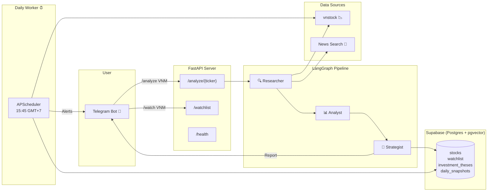

# VN-Stock AI Copilot 🇻🇳📈

AI Agent hỗ trợ đầu tư chứng khoán Việt Nam — phân tích chuyên sâu (Fundamental & Technical) và theo dõi biến động danh mục hàng ngày để đưa ra khuyến nghị **Buy / Hold / Sell** dựa trên chiến lược dài hạn.

## Architecture



## Project Structure

```
stock-agent/
├── agents/
│   ├── __init__.py
│   ├── nodes.py              # LangGraph nodes (researcher, analyst, strategist)
│   └── graph.py              # StateGraph wiring & compilation
├── database/
│   ├── __init__.py
│   ├── schema.sql            # Postgres DDL (stocks, watchlist, theses, snapshots)
│   ├── supabase_client.py    # Singleton Supabase client
│   └── crud.py               # CRUD operations for all tables
├── models/
│   ├── __init__.py
│   └── state.py              # Pydantic schemas & LangGraph AgentState
├── prompts/
│   ├── __init__.py
│   └── system_prompts.py     # Super System Prompt + Daily Follow-up Prompt
├── services/
│   ├── __init__.py
│   ├── vnstock_service.py    # Financial data & technical indicators
│   ├── news_service.py       # News headline search
│   └── telegram_service.py   # Telegram Bot message delivery
├── main.py                   # FastAPI application
├── worker.py                 # Daily cron job (APScheduler)
├── config.py                 # Centralized settings (pydantic-settings)
├── requirements.txt
├── Dockerfile
├── docker-compose.yml
├── .env.example
└── README.md
```

## Quick Start

### 1. Clone & configure

```bash
cp .env.example .env
# Edit .env with your API keys
```

### 2. Run with Docker (recommended)

```bash
docker-compose up -d
```

This starts:
| Service | Description | Port |
|---------|-------------|------|
| `db` | PostgreSQL 16 + pgvector | 5432 |
| `app` | FastAPI server | 8000 |
| `worker` | Daily cron job (15:45 VN) | — |

### 3. Run locally (alternative)

```bash
python -m venv .venv
.venv\Scripts\activate        # Windows
pip install -r requirements.txt

# Start API server
uvicorn main:app --reload --port 8000

# Start worker (separate terminal)
python worker.py
```

## API Reference

| Method | Endpoint | Description |
|--------|----------|-------------|
| `GET` | `/health` | Health check |
| `POST` | `/analyze/{ticker}` | Run full AI analysis → returns report + sends to Telegram |
| `POST` | `/watchlist` | Add symbol to watchlist (`{"symbol": "VNM"}`) |
| `GET` | `/watchlist` | List active watchlist items |
| `DELETE` | `/watchlist/{symbol}` | Close a watchlist item |
| `GET` | `/snapshots/{symbol}` | Get daily snapshots history |

### Example

```bash
# Analyze a ticker
curl -X POST http://localhost:8000/analyze/VNM

# Add to watchlist
curl -X POST http://localhost:8000/watchlist \
  -H "Content-Type: application/json" \
  -d '{"symbol": "VNM", "initial_notes": "Blue-chip dairy"}'
```

## Daily Worker (15:45 GMT+7)

The worker runs automatically every trading day at **15:45** (after market close at 15:00):

1. Fetches all active watchlist symbols
2. Gets today's close price & volume via vnstock
3. Compares with stored **Investment Thesis** (target, stop-loss, entry zone)
4. Applies decision tree:
   - 🔴 Price ≤ Stop-Loss → **CẮT LỖ**
   - 🟢 Price in Entry Zone → **MUA THÊM**
   - 🟡 Price ≥ Target → **CHỐT LỜI**
   - ⚪ Otherwise → **GIỮ**
5. Saves daily snapshot to database
6. Sends combined report to Telegram

Run manually: `python worker.py --once`

## Tech Stack

| Component | Technology |
|-----------|-----------|
| Language | Python 3.11+ |
| API Framework | FastAPI + Uvicorn |
| AI/LLM | LangGraph + Claude 3.5 Sonnet (Anthropic) |
| Market Data | vnstock (HOSE, HNX, UPCOM) |
| Database | Supabase (PostgreSQL + pgvector) |
| Scheduler | APScheduler |
| Notifications | Telegram Bot API |
| Technical Analysis | pandas, numpy, ta |
| Container | Docker + docker-compose |

## License

Private project — all rights reserved.
