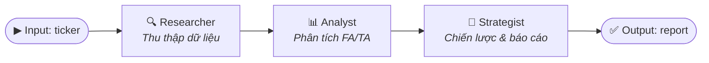
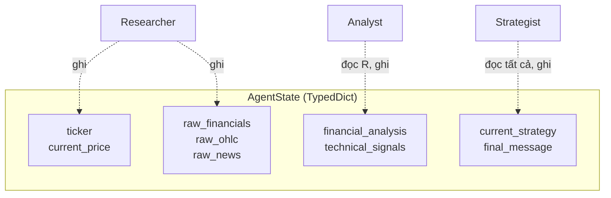

# Agent Pipeline — Cách AI đưa ra kết quả phân tích

## Tổng quan

Hệ thống sử dụng **LangGraph StateGraph** để điều phối 3 AI nodes chạy tuần tự. Mỗi node đọc từ và ghi vào một **AgentState** chung.



---

## Node 1: Researcher — Thu thập dữ liệu

**File**: [nodes.py → researcher_node](file:///c:/Users/PC/Documents/stock-agent/agents/nodes.py#L109)

**Không dùng AI**. Node này chỉ gọi API để lấy dữ liệu raw.

| Nguồn dữ liệu | Hàm gọi | Output |
|----------------|----------|--------|
| Chỉ số tài chính (8 quý) | `vnstock_service.get_financial_ratios()` | Revenue growth, profit growth, ROE, P/E, D/E |
| Giá lịch sử (365 ngày) | `vnstock_service.get_price_history()` | OHLCV DataFrame |
| Chỉ báo kỹ thuật | `vnstock_service.calculate_technical_indicators()` | MA20/50/200, RSI-14, trend, support/resistance |
| Tin tức | `news_service.search_news_sync()` | 5 headline gần nhất |
| Luận điểm cũ | `crud.get_latest_thesis()` | Investment thesis trước đó từ DB |

**State sau Researcher**:
```
raw_financials ← dict chỉ số tài chính
raw_ohlc       ← dict giá + kỹ thuật
raw_news       ← list[str] tin tức
current_price  ← float giá hiện tại
previous_thesis ← str luận điểm cũ (hoặc None)
```

---

## Node 2: Analyst — Phân tích có cấu trúc

**File**: [nodes.py → analyst_node](file:///c:/Users/PC/Documents/stock-agent/agents/nodes.py#L157)

**Dùng Claude 3.5 Sonnet** với `ANALYST_PROMPT` để phân tích dữ liệu raw.

### Flow:
1. Đóng gói `raw_financials` + `raw_ohlc` + `raw_news` thành 1 context Markdown
2. Gửi lên Claude với system prompt yêu cầu trả về **JSON có cấu trúc**
3. Parse JSON response thành 2 Pydantic models

### Prompt yêu cầu:
> Dựa trên dữ liệu, trả về JSON với `financial_analysis` và `technical_signals`

### Output:
```json
{
  "financial_analysis": {
    "revenue_growth": 18.5,
    "profit_growth": 22.3,
    "roe": 21.0,
    "pe_ratio": 15.2,
    "debt_to_equity": 0.8,
    "is_healthy": true    // true nếu đạt ≥ 3/4 tiêu chí
  },
  "technical_signals": {
    "trend": "UP",         // UP | DOWN | SIDEWAYS
    "rsi": 55.3,
    "ma_alignment": "MA20=52,000 > MA50=50,000 > MA200=45,000",
    "support_zone": "48,000",
    "resistance_zone": "56,000"
  }
}
```

---

## Node 3: Strategist — Chiến lược & Báo cáo cuối

**File**: [nodes.py → strategist_node](file:///c:/Users/PC/Documents/stock-agent/agents/nodes.py#L224)

**Dùng Claude 3.5 Sonnet** với `ANALYSIS_SYSTEM_PROMPT` (Super Prompt) để tổng hợp & ra khuyến nghị.

### Flow:
1. Tổng hợp FA summary + TA summary + tin tức + luận điểm cũ
2. Gửi lên Claude với **Super System Prompt** (vai trò Senior Analyst)
3. Claude trả về **báo cáo Markdown hoàn chỉnh**
4. Tính toán `InvestmentStrategy` (entry zone, target, stop-loss)
5. Lưu thesis vào Supabase DB

### Super Prompt logic:
```
FA Audit:
  ├ Revenue & Profit tăng > 15%? → Tích cực
  ├ ROE > 15%? → Quản trị vốn tốt
  ├ Nợ/VCSH < 1.5? → Rủi ro thấp
  └ P_target = EPS_forward × P/E_industry × 0.85 (biên an toàn 15%)

TA Timing:
  ├ MA50 > MA200 → Uptrend
  ├ RSI < 30 → Quá bán (cơ hội mua)
  └ Tìm Entry tại support hoặc breakout + volume đột biến

Strategy:
  └ DCA 3 bước: 30% → 40% → 30%
```

### Output cuối cùng gửi User:
```markdown
## 📊 Báo cáo phân tích: VNM

### 1. Tổng quan Fundamental
[Đánh giá chi tiết FA với số liệu]

### 2. Phân tích kỹ thuật
[Nhận định TA với mốc giá]

### 3. Tin tức & Vĩ mô
[Tóm tắt tin]

### 4. Luận điểm đầu tư
[Thesis 2-3 câu]

### 5. Kế hoạch hành động
| Khuyến nghị | BUY / HOLD / SELL |
| Vùng mua    | xxx - xxx         |
| Giá mục tiêu | xxx             |
| Cắt lỗ      | xxx              |

### 6. Kế hoạch DCA
[Chi tiết 3 bước giải ngân]
```

---

## AgentState — Dữ liệu chạy qua pipeline



| Field | Type | Ghi bởi | Đọc bởi |
|-------|------|---------|---------|
| `ticker` | str | Input | Tất cả |
| `current_price` | float | Researcher | Strategist |
| `raw_financials` | dict | Researcher | Analyst |
| `raw_ohlc` | dict | Researcher | Analyst |
| `raw_news` | list[str] | Researcher | Analyst, Strategist |
| `financial_analysis` | dict | Analyst | Strategist |
| `technical_signals` | dict | Analyst | Strategist |
| `previous_thesis` | str | Researcher (DB) | Strategist |
| `current_strategy` | dict | Strategist | Output |
| `final_message` | str | Strategist | Output → Telegram |

---

## Monitoring

Toàn bộ pipeline được trace tự động trên **LangSmith** (`LANGSMITH_TRACING=true`):
- Xem prompt/response của từng LLM call
- Đo latency mỗi node
- Debug lỗi với full stack trace
